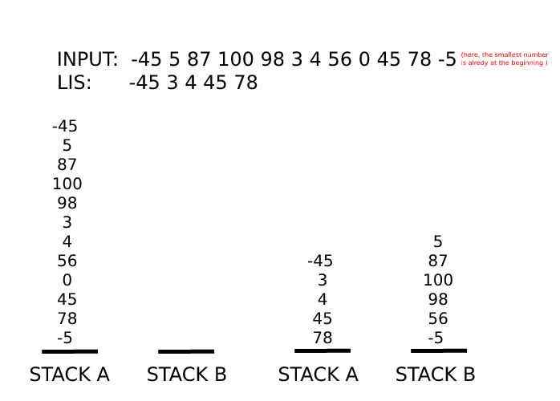

<sub>README still in progress</sub>  
## Description 
Push_Swap is a 42 project which aims to sort a stack using another stack and a specific set moves. 


### Alowed moves
---
***sa***
```
(swap a)
Swap the first 2 elements at the top of STACK A

1      5
5  =>  1
4      3
```
***sb***
```
(swap b)
Swap the first 2 elements at the top of STACK B
```
***ss***
```
sa and sb at the same time.
```
***ra***
```
(rotate a)
In STACK A, the first element becomes the last one.

1      5
5  =>  4 
4      1
```
***rb***
```
(rotate b)
In STACK B, the first element becomes the last one.
```
***rr***
```
ra and rb at the same time.
```
***rra***
```
(reverse rotate a)
In STACK A, the last element becomes the first one.

1      4
5  =>  1
4      5
```
***rrb***
```
(reverse rotate b)
In STACK B, the last element becomes the first one.
```
***rrr***
```
rra and rrb at the same time.
```
### Goal
Sort the stack in the least possible number of moves.  
To get the full mark (125):   

3 numbers should be sorted in: max **2** moves  
5 numbers should be sorted in: max **12** moves  
100 numbers should be sorted in: max **700** moves   
500 numbers should be sorted in: max **5500** moves  

## How  
I implemented "the best element algorithm" (as called by the original creator, check **ressources** folder)
### 1- Parsing:  
if the input is valid, it gets added to a doubly circular linked list called **stack_a**  
#### what's a valid input?
- contains only digits, but may contain ('+' or '-') once at the begining  
- an INT  
- no duplicates   
### 2- Best element algorithm (overview)
1. copy **STACK A**'s content in an array  
2. put the **smallest** number at the begining of the array   
3. extract the [Longuest Increasing Subsequence](https://www.geeksforgeeks.org/longest-increasing-subsequence-dp-3/) from the array  
4. now returning to **STACK A**: push all numbers to **STACK B** except the elements of **LIS**   
5. loop over STACK B calculating for each element:   
	1. number of moves it'll take for the element to be **on top of STACK B** --> the result would be stored in **moves[1]**.   
		- if rb is used the number stored should be positive  
		- if rrb is used the number stored should be negative  
		- *this distinction is made to be able to use rr / rrr in case of matching sign with moves[0]*  
	2. number of moves it'll take to put the element (now hypotetically **on top of STACK A**) in its convenable place in STACK A  --> the result would be stored in **moves[0]**.    
		- if ra is used the number stored should be positive   
		- if rra is used the number stored should be negative  
		- *again, this distinction is made to be able to use rr / rrr is case of matching sign with moves[1]*   
	3. calculate the total number of moves:   
		There is 2 cases:   
		- if moves[0] and moves[1] have the same sign:   
			the total numbers of moves is the **maximum** of both *absolute* values  
		- if moves[0] and moves[1] have different signs:  
			the total numbers of moves is the **sum** of both *absolute* values  
	 4. chose the element with the _smallest_ (total number of moves) and push is to its convenable place in **STACK A**  
6. repeat step 5 until **STACK B** in empty  
7. in **STACK A**, put smallest number on the top  
### 3- My implementation
I used [_doubly circular linked lists_](https://www.geeksforgeeks.org/doubly-circular-linked-list-set-1-introduction-and-insertion/) to store and manipulate the inputed numbers, the following is the structure of a node: 
```c
typedef struct s_node
{
	int		data;
	struct s_node	*prev;
	struct s_node	*next;
	int		moves[2];
	int		nb_mv;
}	t_node;
```
data: the main content of the node: the number  
prev: the previous node  
next: the subsequent node    
moves[2]: the array where the number of moves is stored   
- moves[1]: number of moves to put _data_ on top of STACK B   
- moves[0]: number of moves to put _data_ in its convenable place in STACK A  
nb_mv: total of moves   

Once the input checked and inserted in STACK A,  
I create an array, contaning the elements of STACK A, with the smallest number being at the beginning.   
then extract from it the Longuest Increasing Subsequence, next: I push all the elements that doesn't belong to this LIS from STACK A to STACK B 
```c
void	only_lis(t_node	**head_a, t_node	**head_b)
{
	int		*lis;
	int		lis_len;
	int		o;
	t_node	*first_node;

	lis = lis_constructp1(head_a, list_len(head_a));
	lis_len = lis[0] + 1;
	first_node = *head_a;
	o = 0;
	while (o < lis_len)
	{
		if (in_array(lis, first_node->data, lis_len) == false)
		{
			wich_one_ra_rra(head_a, position(head_a, first_node->data));
			pb(head_a, head_b);
			first_node = *head_a;
		}
		else
		{
			first_node = first_node->next;
			o++;
		}
	}
	free(lis);
	best_element(head_a, head_b);
}
```
Illustration of the previous steps:    

#### How to find a number most convenable place in STACK A?    
